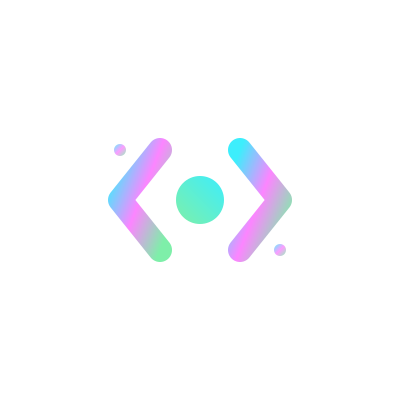
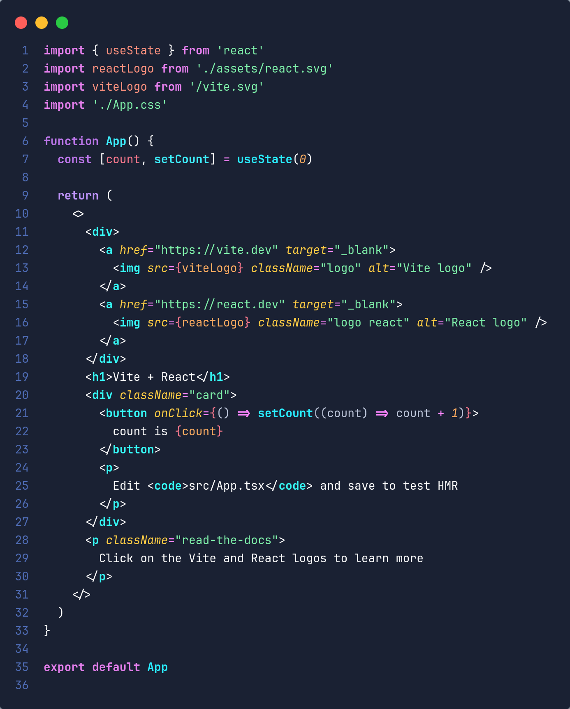
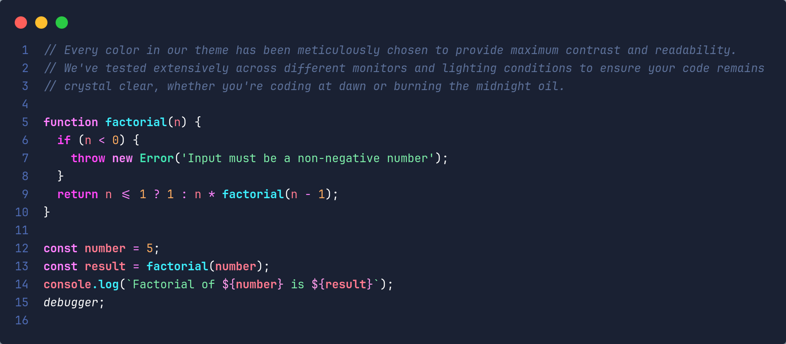
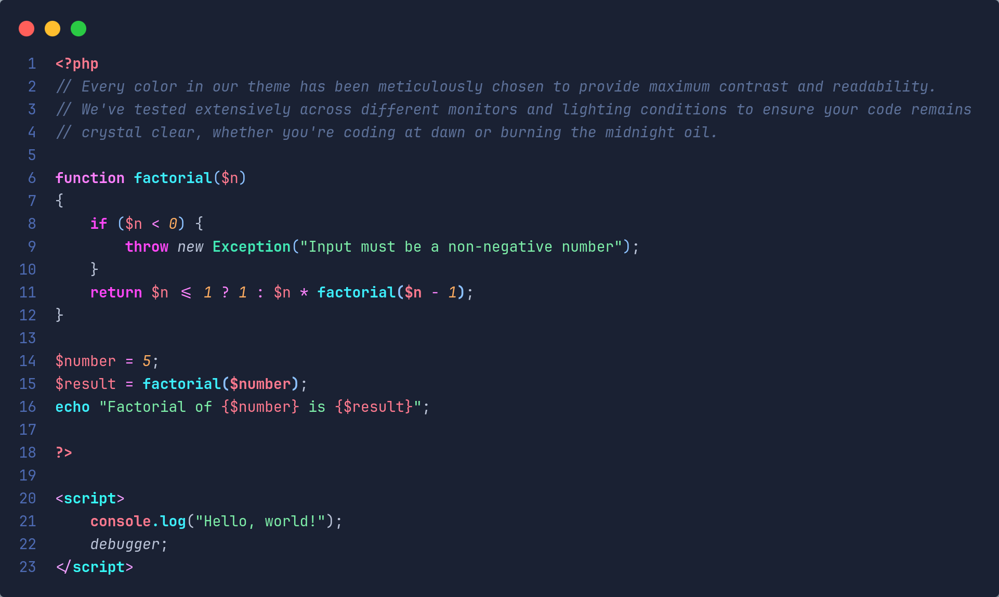
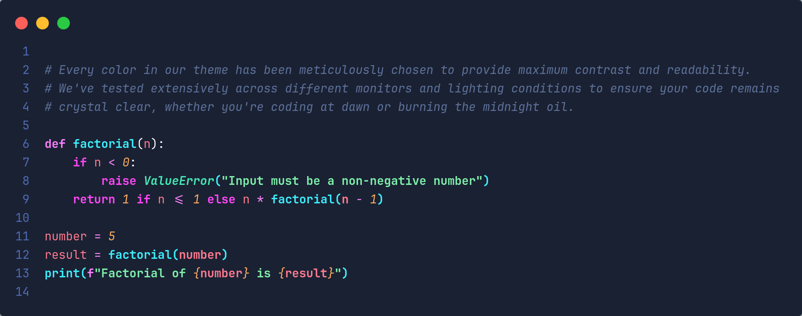
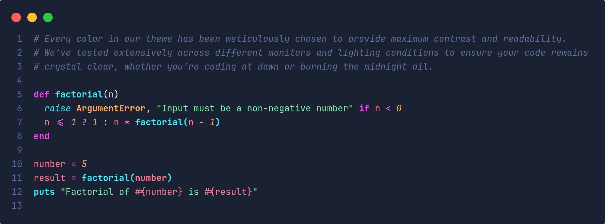

  

<h1 align="center">
  
</h1>

  A carefully crafted VSCode theme for developers who appreciate both aesthetics and functionality.

  <a href="#-features-that-matter">Features</a> •
  <a href="#-installation">Installation</a> •
  <a href="#-code-showcase">Screenshots</a> •
  <a href="#-contributing">Contributing</a>

# Best VSCode Theme

A carefully crafted VSCode theme for developers who appreciate both aesthetics and functionality. This theme combines aesthetic beauty with optimal readability, designed for developers who demand both style and productivity.

## ✨ Features that Matter

### 🎨 Optimized Color Palette

Carefully selected colors that reduce eye strain and enhance code readability. Every color has been meticulously chosen to provide maximum contrast and readability across different monitors and lighting conditions.

### 🌙 Dark Mode Perfection

Deep, rich dark theme that's perfect for long coding sessions. The theme has been tested extensively to ensure your code remains crystal clear, whether you're coding at dawn or burning the midnight oil.

### ✨ Semantic Highlighting

Intelligent syntax highlighting that makes code structure instantly recognizable. Our intelligent color system helps you instantly recognize different code elements:

- Functions and methods in bright cyan
- Variables in soft pink
- Classes and types in mint green
- Keywords and control flow in bright magenta
- Constants and numbers in orange
- Strings in light green
- Comments in grayish blue

### 🚀 Language Support

Enhanced support for popular programming languages and frameworks:

- JavaScript/TypeScript
- PHP
- Python
- Ruby
- HTML/CSS/SCSS
- And many more...

## 💻 Developer-First Design

Created by developers for developers, this theme understands the nuances of modern programming:

- Special attention to popular frameworks and languages
- Consistent highlighting across your entire stack
- Optimized for long coding sessions
- Enhanced readability for nested structures

## 👁️ Unmatched Readability

- Maximum contrast for better code comprehension
- Carefully chosen colors for all UI elements
- Clear distinction between different code elements
- Tested across various environments and conditions

## 🎯 Main Colors

- **Background**: Deep dark blue (#1a2133)
- **Functions/Methods**: Bright cyan (#3deefc)
- **Variables**: Soft pink (#ff7a8f)
- **Classes/Types**: Mint green (#42e8b4)
- **Keywords/Control**: Bright magenta (#ff47f7)
- **Constants/Numbers**: Orange (#ffad61)
- **Strings**: Light green (#7eefa9)
- **Comments**: Grayish blue (#5d7199)

## 🚀 Installation

1. Open **VS Code**
2. Press `Ctrl+P` / `Cmd+P`
3. Type `ext install best-vscode-theme`
4. Press Enter
5. Select the theme from **Preferences > Color Theme > Best VSCode Theme**

## 📸 Code Showcase

### Modern JavaScript & React

_Clean and intuitive highlighting for React components and modern JavaScript features_

### Pure JavaScript

_Crystal clear syntax highlighting for JavaScript with semantic color coding_

### PHP Development

_Enhanced PHP syntax highlighting with clear distinction between language constructs_

### Python Development

_Elegant and readable Python code highlighting with semantic color distinctions_

### Ruby Development

_Beautiful syntax highlighting for Ruby with enhanced readability_

### 🌟 Additional Language Support

While the screenshots above showcase some of our most popular language implementations, Best VSCode Theme provides excellent support for many more languages and frameworks, including:

- HTML/CSS/SCSS/LESS
- TypeScript
- Vue.js
- Angular
- C/C++
- C#
- Java
- Go
- Rust
- SQL
- Markdown
- YAML/JSON
- Shell scripting
- And many more...

### Key Highlighting Features

- 🎨 Semantic color coding for improved code comprehension
- 🔍 Clear distinction between different language constructs
- 💎 Enhanced visibility for method calls and class names
- 🎯 Special attention to framework-specific syntax
- ⚡ Optimized contrast for reduced eye strain

## 🤝 Contributing

We welcome contributions! Please see our [Contributing Guide](CONTRIBUTING.md) for details.

## ☕ Support

If you find this theme helpful, consider [buying me a coffee](https://buymeacoffee.com/lherreralg).

## 📝 License

This theme is licensed under the [MIT License](LICENSE).

---

© 2025 Best VSCode Theme. All rights reserved.
